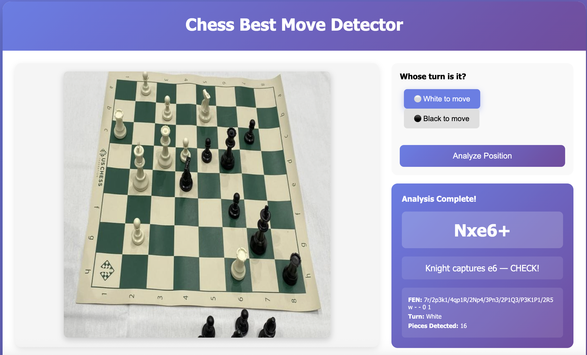
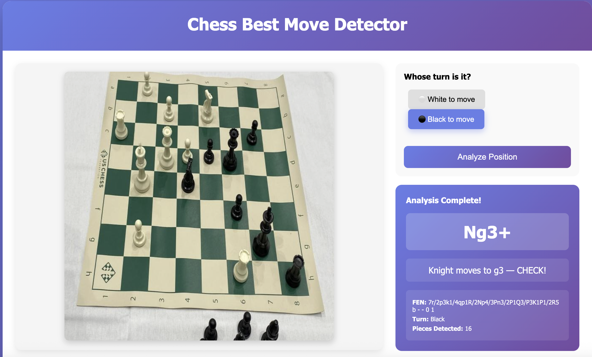
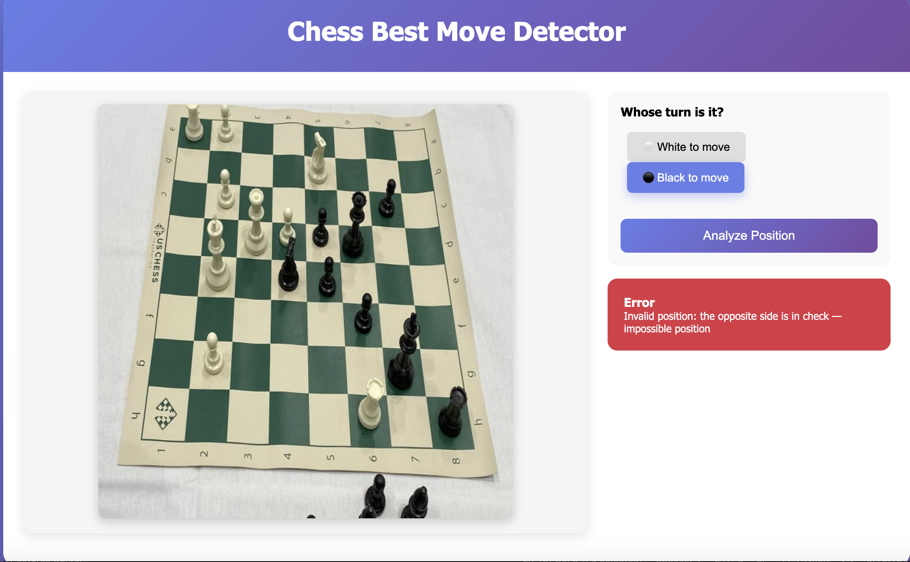
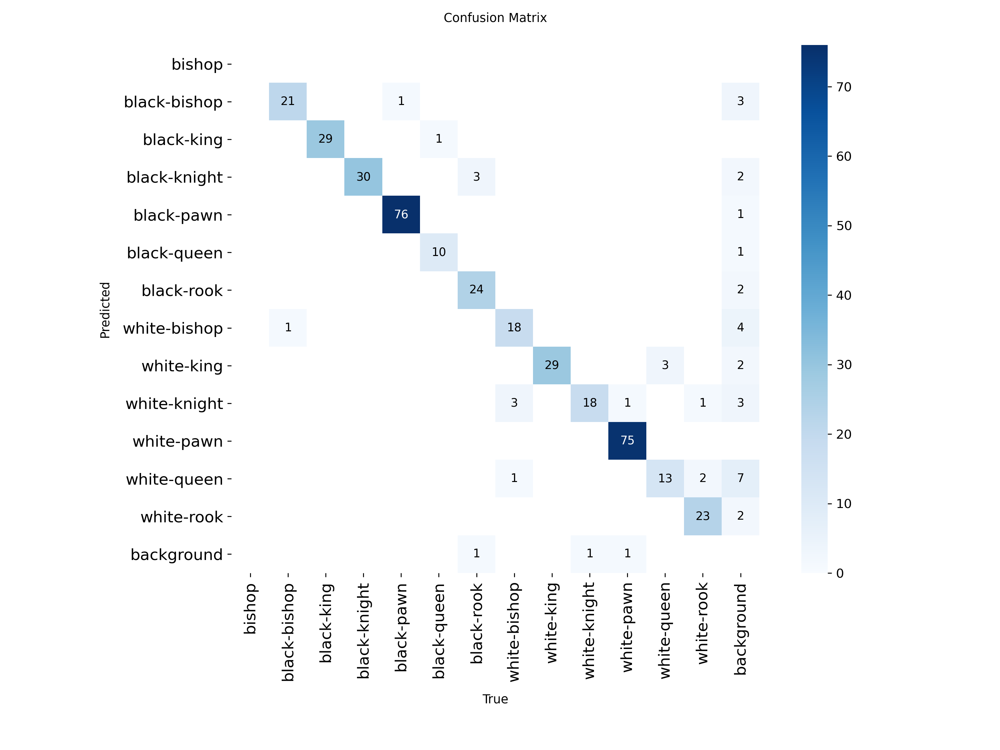
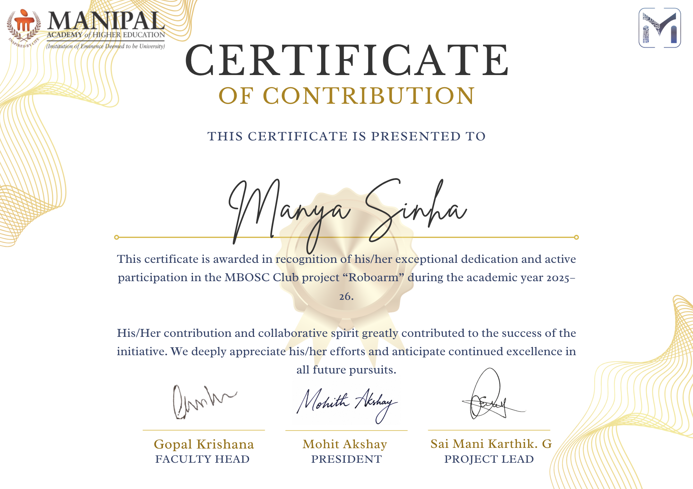

# Roboarm

> A project built under the **MBOSC Club** (Manipal Bangalore Open Source Club), envisioned as a robotic arm that plays chess with you in real time.

This repository contains two components developed as part of the Roboarm initiative:

1. **Chess Best Move Detector**: computer vision + AI pipeline that reads a physical chess board from an image and recommends the best move using Stockfish
2. **OpenCV Actions**: real-time webcam system that detects faces, hands, gestures, and colored objects, intended to drive the robot arm's responses

The original vision: point a camera at a chess board, detect the position, compute the best move, and have a robotic arm physically play it, responding to the human player's gestures in real time.

---

## Repository Structure

```
Roboarm/
│
├── Chess_best_move/               # Chess vision + move recommendation
│   ├── dataset/
│   │   ├── test/
│   │   ├── train/
│   │   ├── valid/
│   │   ├── data.yaml
│   │   ├── README.dataset.txt
│   │   └── README.roboflow.txt
│   ├── frontend/
│   │   └── index.html
│   ├── models/
│   │   └── best.pt
│   ├── src/
│   │   ├── __init__.py
│   │   ├── board_processor.py
│   │   ├── chess_engine.py
│   │   ├── config.py
│   │   ├── data_loader.py
│   │   ├── fen_generator.py
│   │   └── piece_detector.py
│   ├── app.py
│   └── requirements.txt
│
└── openCV_actions/                # Real-time gesture + object detection
    ├── models/
    │   ├── deploy.prototxt
    │   └── res10_300x300_ssd_iter_140000.caffemodel
    ├── camera.py
    ├── colour_detection.py
    ├── face_detection.py
    ├── hand_detection.py
    ├── main.py
    ├── requirements.txt
    ├── shape_detection.py
    └── utils.py

```
---

## Part 1: Chess Best Move Detector

### What It Does

Given an image of a physical chess board, the pipeline:

1. Detects and warps the board to a top-down perspective using OpenCV
2. Runs a YOLOv8 model to detect and classify all pieces on the board
3. Generates a FEN string representing the board state
4. Feeds the FEN to Stockfish to compute the best move
5. Displays the result via a Flask web interface

### Demo

| White to Play | Black to Play |
|---|---|
|  |  |

**Error cases handled**

When the FEN represents an impossible position (e.g. the side not to move is in check), the system catches this and displays a clear error:
- **`STATUS_NO_BLACK_KING`** — Black king missing from the board.
- **`STATUS_NO_WHITE_KING`** — White king missing from the board.
- **`STATUS_TOO_MANY_KINGS`** — More kings on the board than allowed.
- **`STATUS_OPPOSITE_CHECK`** — The side not to move is in check, making the position impossible.
- **`STATUS_TOO_MANY_CHECKERS`** — Too many pieces are simultaneously giving check, which is illegal.

> `Invalid position: the opposite side is in check: impossible position`



---

### Model Performance

The YOLOv8 model was trained on a Roboflow chess piece dataset. Evaluation on the validation set:

| Class | Precision | Recall | mAP50 | mAP50-95 |
|---|---|---|---|---|
| **All** | 0.961 | 0.949 | 0.981 | 0.723 |
| black-bishop | 0.921 | 0.955 | 0.960 | 0.651 |
| black-king | 0.966 | 1.000 | 0.994 | 0.763 |
| black-knight | 0.938 | 1.000 | 0.994 | 0.727 |
| black-pawn | 1.000 | 0.991 | 0.995 | 0.739 |
| black-queen | 1.000 | 0.873 | 0.988 | 0.729 |
| black-rook | 1.000 | 0.847 | 0.995 | 0.714 |
| white-bishop | 0.956 | 0.993 | 0.975 | 0.663 |
| white-king | 0.933 | 1.000 | 0.995 | 0.811 |
| white-knight | 0.930 | 0.947 | 0.971 | 0.711 |
| white-pawn | 1.000 | 0.979 | 0.994 | 0.752 |
| white-queen | 0.887 | 0.875 | 0.938 | 0.676 |
| white-rook | 1.000 | 0.933 | 0.970 | 0.744 |

**Confusion Matrix:**



#### A Note on Overfitting

The model shows strong mAP50 scores (0.938 to 0.995 across all classes) but noticeably lower mAP50-95 scores (0.651 to 0.811). The gap between the two (high precision at 50% IoU, weaker performance at stricter thresholds) is a classic sign of overfitting to the training distribution. The model likely learned dataset-specific visual patterns (lighting, board style, piece set) rather than fully generalising. For deployment on diverse real-world boards, fine-tuning on a broader dataset or applying augmentation techniques would help close this gap.

---

### Stack

- **YOLOv8** (Ultralytics): piece detection
- **OpenCV**: board contour detection + perspective warp
- **python-chess + Stockfish**: FEN validation and best move calculation
- **Flask**: web interface

### Setup

**Prerequisites:** Python 3.10+, Stockfish installed on your system

```bash
# Install Stockfish
brew install stockfish        # macOS
sudo apt install stockfish    # Linux

# Install Python dependencies
pip install -r Chess_best_move/requirements.txt

# Configure paths in src/config.py
# Set BASE_PATH, MODEL_PATH, DATASET_PATH, and optionally FIXED_IMAGE_NAME

# Run
python Chess_best_move/app.py
# Open http://localhost:8000
```

### How It Works

```
Image → Board Detection (OpenCV) → Perspective Warp
      → Piece Detection (YOLOv8) → FEN Generation
      → Stockfish → Best Move
```

The board is detected using edge/contour detection, then warped to a flat 800x800 grid. Each piece's bottom-centre point is mapped through the perspective transform to determine its square. Squares with multiple detections keep the highest-confidence one.

---

## Part 2: OpenCV Actions

### What It Does

A real-time webcam pipeline that detects faces, hands, and objects, designed as the sensory layer for the robot arm. The arm would respond to the human player's gestures between moves.

**Detections:**
- **Faces**: DNN-based face detector (ResNet SSD), used to mask face regions from colour detection
- **Hands**: MediaPipe hands, with finger counting and gesture recognition
- **Gestures**: Fist, Open Hand, Thumbs Up, Wave (via horizontal motion tracking)
- **Coloured objects**: HSV-based detection for Red, Orange, Yellow, Green, Blue, Purple, Black, White, with shape classification (Circle, Ellipse, Square, Rectangle, Triangle)

**Robot arm action mapping:**

| Gesture | Bot Action |
|---|---|
| Fist | Fist bump |
| Open Hand | Frozen! |
| Wave | Waves back |
| Thumbs Up | Gives Thumbs Up |

### Setup

```bash
pip install -r openCV_actions/Actions/requirements.txt

# DNN face detection model files are required:
# - Actions/models/deploy.prototxt
# - Actions/models/res10_300x300_ssd_iter_140000.caffemodel
# Download from OpenCV's model zoo or use the included files

python openCV_actions/Actions/main.py
```

> **Note:** Python 3.10 is required for MediaPipe compatibility.

---

## Background

This project was built as part of **Roboarm**, a collaborative initiative under the **MBOSC Club** (Manipal Bangalore Open Source Club). The goal was a physical robot arm that could:

- Watch a chess board through a camera
- Detect the current position and compute the best move using Stockfish
- Use gesture recognition to know when the human player had finished their move
- Physically play its response on the board

The chess vision pipeline and gesture detection system represent the software foundation for that hardware vision. 


---

## Acknowledgements

- [Roboflow](https://roboflow.com): dataset annotation and management
- [Kaggle Dataset Link](https://www.kaggle.com/datasets/manya3zero/chess-pieces): Dataset downloaded from roboflow
- [Ultralytics YOLOv8](https://github.com/ultralytics/ultralytics): object detection framework
- [Stockfish](https://stockfishchess.org): chess engine
- [MediaPipe](https://mediapipe.dev): hand landmark detection
- [python-chess](https://python-chess.readthedocs.io): FEN parsing and move validation
- MBOSC Club, Manipal Bangalore
